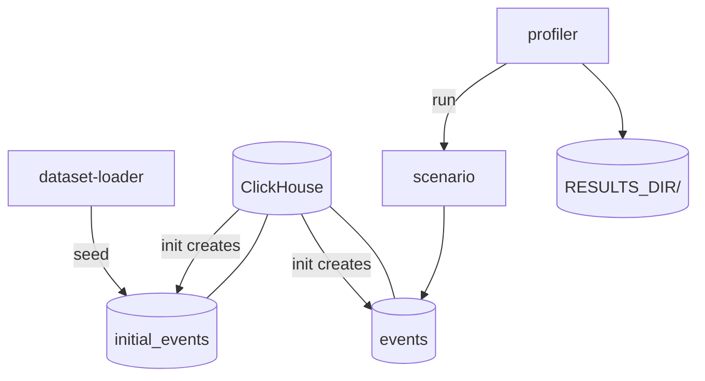

# ClickHouse Profiler

ClickHouse benchmarking toolkit for evaluating write-read workloads. The project provides a shared test environment — ClickHouse with a synthetic event dataset — and a **profiler** that runs isolated benchmark scenarios, each targeting a different aspect of database performance.

Part of the [Yandex Practicum diploma project](https://github.com/rock4ts/yap2_diploma) — used to profile ClickHouse before integrating a UGC module into the platform.

## Architecture

The stack has three layers: ClickHouse infrastructure, a one-time dataset loader, and a profiler CLI that dispatches to individual benchmark scenarios. Each run executes exactly one scenario (`python -m app.main run <scenario>`).



| Component | Role |
|-----------|------|
| **clickhouse** | ClickHouse 25.6 server with fixed CPU/RAM limits for reproducible benchmarks |
| **dataset-loader** | Generates and loads synthetic event records into `initial_events`; truncates and reseeds data only |
| **profiler** | CLI entry point — selects and runs one scenario per invocation |
| **scenarios** | Pluggable benchmarks under `profiler/app/scenarios/`; `write_read` is the first implemented scenario |
| **results** | Timestamped output per scenario run (`$RESULTS_DIR/<scenario>/<timestamp>/`; default `results/`; timestamps use local time) |

### Shared data model

Both tables use the same schema:

| Column | Type | Description |
|--------|------|-------------|
| `user_id` | UInt32 | Synthetic user identifier (1–10 000) |
| `category` | String | One of A–E |
| `amount` | Float64 | Transaction amount (Gaussian distribution) |
| `status` | String | `success`, `failed`, or `pending` |
| `region` | String | `North`, `South`, `East`, or `West` |
| `timestamp` | DateTime | Event timestamp |

- **`initial_events_local` / `events_local`** — replicated shard-local tables (`ReplicatedMergeTree`) created by `clickhouse-init`.
- **`initial_events` / `events`** — distributed front tables over `ugc_cluster` created by `clickhouse-init`.
- The dataset loader truncates local tables on the cluster and reseeds `initial_events`; scenarios reset `events_local` and then restore `events` from `initial_events`.

## Profiler

The profiler is a scenario-based CLI. Each scenario lives in `profiler/app/scenarios/<name>/`, has its own configuration class, and writes results under `$RESULTS_DIR/<name>/` (see `RESULTS_DIR` below).

```bash
python -m app.main run <scenario>
```

Shared settings (ClickHouse connection, results directory, container resource metadata) apply to all scenarios. Scenario-specific settings use a dedicated env prefix (e.g. `WR_` for `write_read`).

Cluster resource metadata is derived from per-node settings: `CLICKHOUSE_NODE_COUNT * CLICKHOUSE_NODE_CPUS` and `CLICKHOUSE_NODE_COUNT * CLICKHOUSE_NODE_RAM_GB`.

### Available scenarios

| Scenario | Status | What it measures |
|----------|--------|------------------|
| `write_read` | implemented | Concurrent insert throughput under parallel aggregation query load |

More scenarios can be added for other patterns (bulk load, point lookups, materialized views, etc.) — see [Adding scenarios](#adding-scenarios).

---

### Scenario: `write_read`

Simulates a mixed OLAP-style workload: writers continuously insert event batches while readers run aggregation queries against the same table.

For each combination of writer thread count and insert batch size, the scenario:

1. **Warm-up** *(optional, enabled by default)* — resets `events`, clears ClickHouse caches, and runs the mixed workload for `PROFILER_WARMUP_DURATION_SECONDS`. Warm-up metrics are not recorded.
2. **Measured run** — resets `events`, clears caches again, runs the same workload for `WR_DURATION_SECONDS`, and appends one row to `profile.csv`.

During each workload run (warm-up and measured), N writer threads insert batches while M reader threads execute aggregation queries (GROUP BY category, region, user_id) in parallel. The measured run records rows written, ingestion throughput, query count, and query latency (avg, p95, max).

Table reset and cache clearing (`SYSTEM DROP MARK CACHE`, `SYSTEM DROP UNCOMPRESSED CACHE`, `SYSTEM DROP QUERY CACHE`) run in `profiler/app/clickhouse/reset.py` before both warm-up and measured runs. If a cache command is unsupported or fails, the run continues and logs a warning.

Disable warm-up with `PROFILER_WARMUP_ENABLED=false` when you need faster iteration or want to measure cold-start behavior only.

Default parameter grid: writer threads `{3, 4, 5}` × batch sizes `{3000, 5000, 8000}`.

**Results** — written to `$RESULTS_DIR/write_read/<timestamp>/` (default: `results/write_read/<timestamp>/`):

```
$RESULTS_DIR/write_read/20260708T091734/
├── metadata.json   # ClickHouse limits, scenario config, and warm-up settings
└── profile.csv     # One row per (writers, batch_size) measured run
```

`metadata.json` includes a `warmup` object (`enabled`, `duration_seconds`) alongside `clickhouse_cluster` (node inputs plus computed totals) and `scenario_config`.

| Column | Description |
|--------|-------------|
| `writers` | Number of concurrent writer threads |
| `batch_size` | Rows per insert batch |
| `readers` | Number of concurrent reader threads |
| `run_duration_sec` | Actual duration of each measured run |
| `rows_written` | Total rows inserted during the run |
| `ingestion_throughput_per_sec` | Rows inserted per second |
| `queries_executed` | Successful aggregation queries |
| `avg_agg_query_time` | Average query latency (ms) |
| `p95_agg_query_time` | 95th percentile query latency (ms) |
| `max_agg_query_time` | Maximum query latency (ms) |

**Configuration** — env prefix `WR_`:

| Variable | Default | Description |
|----------|---------|-------------|
| `WR_DURATION_SECONDS` | `120` | Duration of each experiment (seconds) |
| `WR_INSERT_BATCH_SIZE_LIST` | `[3000,5000,8000]` | Batch sizes to sweep |
| `WR_WRITER_THREAD_LIST` | `[3,4,5]` | Writer thread counts to sweep |
| `WR_READER_THREADS` | `10` | Concurrent reader threads |
| `WR_MAX_RETRIES` | `3` | Insert retry attempts on failure |
| `WR_INSERT_REQUEST_TIMEOUT_SECONDS` | `10` | ClickHouse `max_execution_time` for inserts |
| `WR_READ_REQUEST_TIMEOUT_SECONDS` | `20` | ClickHouse `max_execution_time` for reads |

## Prerequisites

- Docker and Docker Compose v2
- Python 3.12+ *(optional, for running services locally outside Docker)*

## Quick start

`docker-compose.yml` runs the full pipeline with the `write_read` scenario as a demo:

```bash
docker compose up --build
```

This will:

1. Start ClickHouse (8 CPUs, 8 GB RAM cluster total by default) and run `clickhouse-init` schema setup from `ch_config/init`.
2. Load 10 million synthetic events into `initial_events` (skipped on subsequent runs if already populated).
3. Run `write_read` and write results to `$RESULTS_DIR/write_read/<timestamp>/` (default `results/`).

To tear down containers and remove the ClickHouse volume:

```bash
docker compose down -v
```

In `docker-compose.yml`, `WR_DURATION_SECONDS=30` and `PROFILER_WARMUP_DURATION_SECONDS=15` keep demo runs short. Increase `WR_DURATION_SECONDS` for meaningful benchmarks; set `PROFILER_WARMUP_ENABLED=false` to skip warm-up during quick smoke tests.

## Configuration

### Dataset loader

| Variable | Default | Description |
|----------|---------|-------------|
| `RECORDS_COUNT` | — | Total rows to generate |
| `BATCH_SIZE` | — | Insert batch size during load |
| `SKIP_IF_POPULATED` | `true` | Skip load when `initial_events` already has enough rows |
| `CLICKHOUSE_HOST` | — | ClickHouse host |
| `CLICKHOUSE_PORT` | `9000` | Native TCP port |
| `CLICKHOUSE_USER` | — | Database user |
| `CLICKHOUSE_PASSWORD` | — | Database password |
| `CLICKHOUSE_DATABASE` | — | Target database |
| `CLICKHOUSE_TABLE` | `events` | Benchmark table name |
| `CLICKHOUSE_INITIAL_TABLE` | `initial_events` | Seed table name |
| `CLICKHOUSE_LOCAL_TABLE` | `events_local` | Cluster-local benchmark table used for truncate/reset |
| `CLICKHOUSE_INITIAL_LOCAL_TABLE` | `initial_events_local` | Cluster-local seed table used for truncate/reseed |
| `CLICKHOUSE_CLUSTER` | `ugc_cluster` | Cluster name used in `ON CLUSTER` truncation |

### Profiler (shared)

These settings apply to every scenario:

| Variable | Default | Description |
|----------|---------|-------------|
| `CLICKHOUSE_HOST` | `localhost` | ClickHouse host |
| `CLICKHOUSE_PORT` | `9000` | Native TCP port |
| `CLICKHOUSE_USER` | `profiler` | Database user |
| `CLICKHOUSE_PASSWORD` | `profiler` | Database password |
| `CLICKHOUSE_DATABASE` | `profiler` | Target database |
| `CLICKHOUSE_TABLE` | `events` | Benchmark table name |
| `CLICKHOUSE_INITIAL_TABLE` | `initial_events` | Seed table name |
| `CLICKHOUSE_LOCAL_TABLE` | `events_local` | Cluster-local benchmark table used for `TRUNCATE ... ON CLUSTER` |
| `CLICKHOUSE_INITIAL_LOCAL_TABLE` | `initial_events_local` | Cluster-local seed table name |
| `CLICKHOUSE_CLUSTER` | `ugc_cluster` | Cluster name used for distributed reset operations |
| `RESULTS_DIR` | `results` | Root directory for profiler output (`$RESULTS_DIR/<scenario>/<timestamp>/`) |
| `CLICKHOUSE_NODE_COUNT` | `4` | Number of ClickHouse nodes used to calculate cluster totals in metadata |
| `CLICKHOUSE_NODE_CPUS` | `2` | Per-node CPU limit used to calculate `clickhouse_cluster.cpus` metadata |
| `CLICKHOUSE_NODE_RAM_GB` | `2` | Per-node RAM (GiB) used to calculate `clickhouse_cluster.ram_limit` metadata |
| `PROFILER_WARMUP_ENABLED` | `true` | Run a warm-up workload before each measured experiment |
| `PROFILER_WARMUP_DURATION_SECONDS` | `15` | Duration of each warm-up run (seconds) |

Scenario-specific variables are documented under each scenario above.

## Running individual services

### ClickHouse only

```bash
docker compose up clickhouse -d
```

Connect via HTTP on port `8123` or native TCP on port `9000` (user/password: `profiler`/`profiler`, database: `profiler`).

### Dataset loader only

```bash
docker compose up dataset-loader --build
```

### Profiler — specific scenario

Requires ClickHouse with a populated `initial_events` table. The compose file includes a preconfigured `write_read` service:

```bash
docker compose up wr-profiler --build
```

### Local development (without Docker)

With ClickHouse running and reachable:

```bash
# Dataset loader
cd dataset_loader
pip install -r requirements.txt
cp .env.example .env   # set CLICKHOUSE_HOST=localhost
python -m app.main

# Profiler — pick a scenario
cd profiler
pip install -r requirements.txt
cp .env.example .env
python -m app.main run write_read
```

## Project structure

```
clickhouse_profiler/
├── docker-compose.yml          # Full stack; demo runs write_read
├── dataset_loader/             # Synthetic data generation and initial load
│   ├── app/
│   │   ├── main.py
│   │   ├── clickhouse.py       # Cluster truncate checks and bulk insert
│   │   ├── generator.py        # Batch record generator
│   │   └── config.py
│   └── Dockerfile
├── profiler/                   # Scenario-based benchmark runner
│   ├── app/
│   │   ├── main.py             # CLI: run <scenario>
│   │   ├── config.py           # Shared + per-scenario settings
│   │   ├── metrics.py          # Latency and throughput helpers
│   │   ├── clickhouse/         # Client, table reset, cache clear, query operations
│   │   └── scenarios/
│   │       └── write_read/     # Mixed write/read benchmark
│   └── Dockerfile
└── $RESULTS_DIR/               # default: results/
    └── <scenario>/
        └── <timestamp>/
```

## Adding scenarios

1. Create `profiler/app/scenarios/<name>/` with a `run(scenario_config, clickhouse_config, profiler_config)` function and a reporter module.
2. Add a config class in `profiler/app/config.py` (use a unique env prefix).
3. Register the scenario in `profiler/app/main.py` — add to `SCENARIOS`, `_load_scenario_config`, and `_get_scenario_runner`.
4. Write results to `$RESULTS_DIR/<name>/<timestamp>/`.

Run the new scenario:

```bash
python -m app.main run <name>
```
